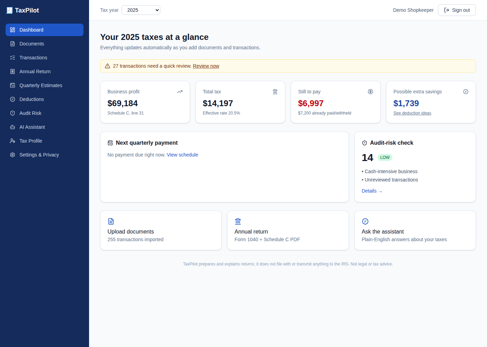
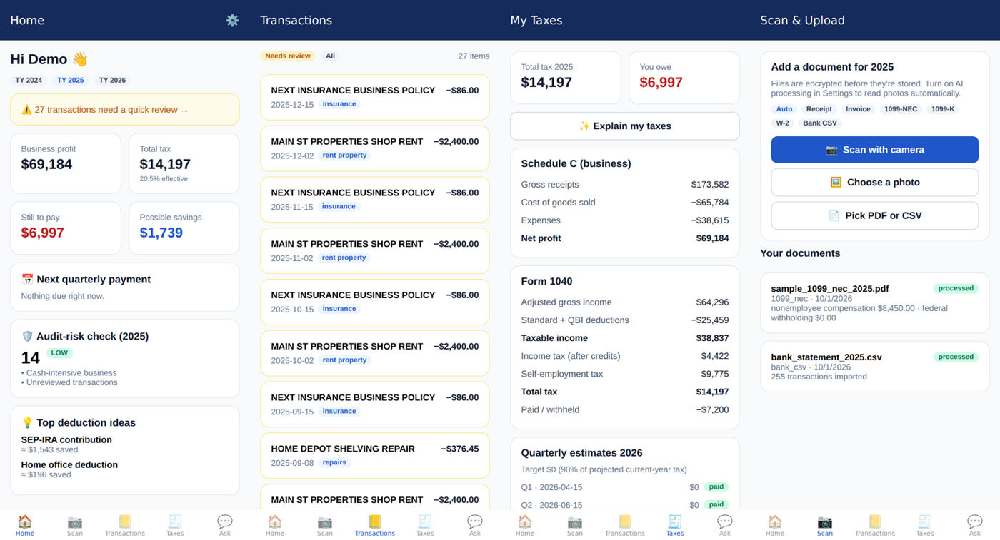

# 🧾 TaxPilot — AI tax preparation & planning for freelancers, gig workers and shopkeepers

TaxPilot helps U.S. self-employed people (1099 contractors, delivery and rideshare
drivers, and small shop owners) **do their own federal taxes without hiring an
accountant**. Upload a bank statement, 1099s or receipt photos; TaxPilot sorts
every transaction into the right Schedule C line, finds missed deductions,
plans quarterly payments, flags audit risks, explains everything in plain
English, and produces a filing-ready **Form 1040 + Schedule C** PDF.

> TaxPilot prepares, calculates and explains. It never e-files and never
> connects to IRS systems. Not legal or tax advice.

| Web (React + Tailwind) | Mobile (Expo / React Native) |
| --- | --- |
|  |  |

---

## 1. Executive summary

**Problem.** Self-employed people face confusing rules, mix personal and business
spending, miss deductions, get penalized for skipping quarterly payments, worry
about audits, and often pay an accountant for work that's mostly bookkeeping.
A shopkeeper also needs cost-of-goods-sold and cash-sales handling that generic
tools skip.

**Solution.** A local, privacy-first platform with three clients of one API:

| Capability | How |
| --- | --- |
| Secure accounts | Password + **email OTP MFA**, JWT access tokens, rotating refresh tokens with theft detection, lockout, rate limits |
| Document intake | Bank CSV import, W-2/1099 PDF and photo extraction (**OpenAI** with a regex fallback), invoices and receipts; files **AES-256-GCM encrypted** |
| Categorization | Keyword rules plus **OpenAI Structured Outputs** mapping to Schedule C lines, with business-use %, confidence and a review queue |
| Tax engine | Deterministic, unit-tested: Schedule C (incl. **COGS/inventory**), SE tax, Additional Medicare, QBI, standard / 65+ / OBBBA tips & senior deductions, CTC/ACTC; TY2024–2026 |
| Planning | Quarterly 1040-ES estimates with 90% / 100% / 110% safe harbor and due dates |
| Deductions | Rule-based finder with dollar savings, plus optional AI ideas |
| Audit risk | 11 transparent heuristics (1099 mismatch, losses, cash business, vehicle, meals…) with fixes, explained by AI |
| Explanations | AI (or template) plain-English summaries and Q&A grounded in the user's own numbers |
| Output | ReportLab PDF: Form 1040, Schedules 1, 2, C, SE and the Form 8995 summary |
| Admin | Monitoring dashboard, masked user management, append-only audit log, RBAC |

**Design principle: AI explains, the engine calculates.** No tax number comes
from a language model, and every AI feature has an offline fallback. AI is
opt-in per user, and text is PII-redacted before it's sent.

## 2–10. Deliverables

| # | Section | Where |
| --- | --- | --- |
| 1 | Executive Summary | this file |
| 2 | System Architecture (ASCII diagrams) | [`docs/ARCHITECTURE.md`](docs/ARCHITECTURE.md) |
| 3 | Database Schema (SQL) | [`docs/schema.sql`](docs/schema.sql) · ORM: [`backend/app/models`](backend/app/models/__init__.py) |
| 4 | API Specification (OpenAPI) | [`docs/API.md`](docs/API.md) · [`docs/openapi.json`](docs/openapi.json) |
| 5 | Backend Code (FastAPI) | [`backend/app`](backend/app) — routes, services, tax engine ([`app/tax`](backend/app/tax)) |
| 6 | AI Pipeline Code (OpenAI) | [`backend/app/ai`](backend/app/ai) — client, prompts, classifier, document extractor, explainer |
| 7 | Frontend Structure (React) | [`frontend/src`](frontend/src) · mobile: [`mobile/`](mobile/README.md) |
| 8 | Security Model | [`docs/SECURITY.md`](docs/SECURITY.md) |
| 9 | Local Setup Instructions | [`docs/SETUP.md`](docs/SETUP.md) |
| 10 | Future Roadmap | [`docs/ROADMAP.md`](docs/ROADMAP.md) |

## Quick start

```bash
# 1) Database + local mail inbox
docker compose up -d

# 2) Backend
cd backend && python -m venv .venv && source .venv/bin/activate
pip install -r requirements-dev.txt
cp .env.example .env && python scripts/generate_secrets.py   # paste into .env; add OPENAI_API_KEY (optional)
python scripts/seed_demo.py                                  # demo@example.com / DemoShop2025!
uvicorn app.main:app --reload                                # http://localhost:8000/docs

# 3) Web app
cd ../frontend && npm install && npm run dev                 # http://localhost:5173

# 4) Mobile app
cd ../mobile && npm install && cp .env.example .env.local && npx expo start
```

Sign-in codes are printed in the backend terminal (`EMAIL_BACKEND=console`) or
appear in Mailpit at <http://localhost:8025>. Full details and troubleshooting:
[`docs/SETUP.md`](docs/SETUP.md).

## Project structure

```
backend/   FastAPI + SQLAlchemy + PostgreSQL, OpenAI pipeline, tax engine, ReportLab PDFs, pytest suite
frontend/  React 19 + Tailwind CSS v4 (Vite) web app
mobile/    Expo SDK 57 + Expo Router (iOS / Android)
docs/      architecture, schema.sql, API spec, security model, setup, roadmap
scripts/   local TLS certificate generator
```

## Quality checks

| Check | Command | Status |
| --- | --- | --- |
| Backend tests (engine, API end-to-end, AI with a fake OpenAI client, encryption at rest, RBAC, IDOR) | `cd backend && pytest -q` | 38 passing (SQLite and PostgreSQL 16) |
| Web build | `cd frontend && npm run build` | ✓ |
| Mobile config and bundles | `cd mobile && npx expo-doctor && npx expo export --platform android` | 21/21 checks, Android + iOS bundles ✓ |

## Tax coverage and limits

Federal returns for sole proprietors (Schedule C) for tax years 2024, 2025 and 2026,
including the One Big Beautiful Bill Act changes (higher 2025 standard deduction,
$2,200 CTC, tips and senior deductions, wider QBI phase-in and $400 minimum from 2026).
**Not yet covered** (shown as warnings): itemized deductions, capital-gain rates,
AMT, NIIT, EITC, depreciation schedules, state taxes. All year-specific numbers
live in [`backend/app/tax/tables.py`](backend/app/tax/tables.py) and should be
checked against IRS publications each season.
